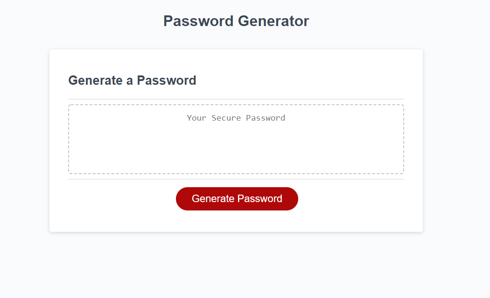

# Password Generator homework

## description

My password generator gives you the options of Uppercase and Lowercase letters, numbers, and symbols. The generator gives you a list of prompts including a length prompt where you must enter a value between 8-128, anything outside of that peramiter will result in the generator prompting you to try again.

## Links 

Github Repo: https://github.com/Henryrjung/03_password_generator 

Git pages website: https://henryrjung.github.io/03_password_generator/

## Screenshot 

## issues 
With this homework I mainly had problems with syntax, and understanding how things connected to each other, primarily how the strings of number,sybol etc... is used by the function.

## Credits

1. class repo
1. "creating a random password generator" by Nazmus Nasir on youtube(His video really helped me understand how the script all works together.)
1. w3 schools 